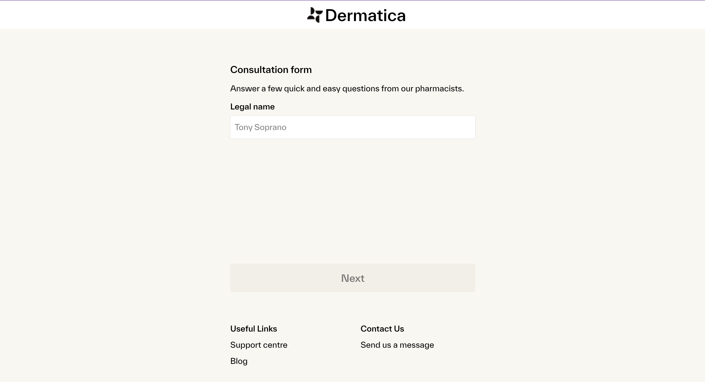
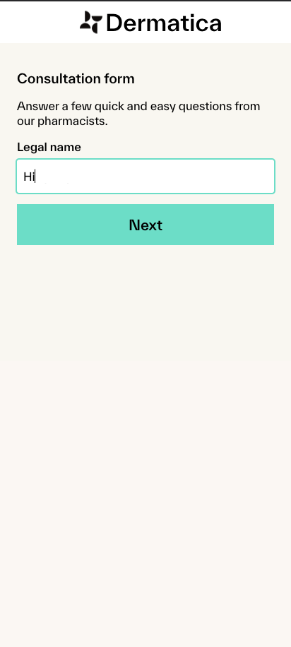

# HeliosX Tech Test - Conor Butler

## Running the project

```bash
yarn
yarn dev
```

If you are having issues running the above, make sure that you have the following:

**Node version: 20.11.1**

**Yarn version: 4.1.0**

If you are using [volta](https://volta.sh/) it will automatically set the correct versions for you.

## Running the tests

```bash
yarn test
```

## Screenshots

### Desktop



### Mobile



### Video Demo

[]

## Tech choices

### React, bootstrapped with Vite

I'm a big fan of Vite for it's simplicity and speed when developing locally. I think a fully fledged React framework like Next.js and Remix would be a bit overkill for this task as there's no need for server side rendering or routing. I wanted to focus on the form logic and component composition instead.

### PostCSS

I used PostCSS for styling, which comes with CSS Modules out of the box. I like this because it helps declutter the component files and allows me not to have to think about class names - as long as they make sense in the context of the component it's all good. It also supports nesting and other features that allow you to write atomic and concise CSS, while still using actual CSS principles.

### Jest and React Testing Library

I used Jest and React Testing Library for testing. I like the way React Testing Library encourages you to test your components for accessibility, and I made sure of this by using their [suggested priority of queries](https://testing-library.com/docs/queries/about/#priority). It also has a lot of built in utilities that make it easy to test user interactions, and in general makes you write tests that resemble how users actually interact with your code.

### Using as few libraries as possible

In my day job, I'd never hand roll a form like this as there's no need to reinvent the wheel, and it's comparatively very time consuming. However I wanted to demonstrate my understanding of React, and I learnt some stuff along the way. It was fun! Other than those listed above, the only other third party library I used was [classnames](https://www.npmjs.com/package/classnames) for conditionally applying classes to components.

## My approach

### Time management

As you can see from the commit history, I took a bit longer than the suggested time for the task. This was because I ran into a few configuration issues - every time I do use this stack something has changed slightly in this regard. Also I probably spent an unnecessary amount of time on the styling, but I'm a perfectionist.

### Misinterpreting the brief

For about half of this attempt, I skipped over the part of the requirements that says **"5 yes/no questions"**. Instead, I tried to replicate the text inputs seen on [Dermatica for example](https://www.dermatica.co.uk/registration). I kept these some text inputs in my final submission so my work didn't go to waste, but I also added the yes/no questions with the [RadioInput](src/components/radio-input/radio-input.tsx) component.

### Test coverage

As this test does not interact with an API, it allowed me to get quite thorough with my unit tests and test a lot of user interactions. I actually enjoy writing tests with this level of detail, it's interesting to think about all of the ways a user could interact with your code and how you can account for that (and test it).

### Generic components and types

I tried to make the components as generic as possible, so that they could be reused in other ways in the future. I also used the React element types as part of my component interfaces to allow passing of common props like `onClick`, should you want to add a tracking event or something similar.

### Design tokens

I didn't fully commit to this idea, but I tried to use a few design tokens in the form of [CSS variables](src/styles/tokens.css). I think this is a good way to keep your styles consistent and easy to change in the future. I could spend forever thinking of the perfect token names and how to structure them, but it probably shouldn't be the focus of this task. Again I'm a fan of standard CSS here instead of a more complex solution like SASS or CSS in JS solutions, although those can offer some benefits like type safety.

## Future improvements

### Better validation/unhappy path handling

With just yes or no questions, there isn't much to validate. However, if I were to work on this further, I would add something that persists the users answers in local storage and perhaps alerts them when they try and navigate away during the form. I did want to add some more tests for the [TextInput](src/components/text-input/text-input.tsx) though, (you can see them as .todos in the test file).

### Separating language from the components

In production code, I'd never just hard code strings into components. In a real environment, copy would come from a CMS or other service, or at the very least live in separate files. This would make it easier to make changes to the copy without having to touch the components, and expand into other languages - although the brief specified this is not a concern at the moment.

### Refactoring the Form component

The [Form](src/components/form/form.tsx) component has become quite complex and could be benefit from some simplification and code splitting. There's also a lot of state being set that could be extracted into a context provider and hook which would make it more readable and easier to reuse - it could be used to make other form templates in the future.
